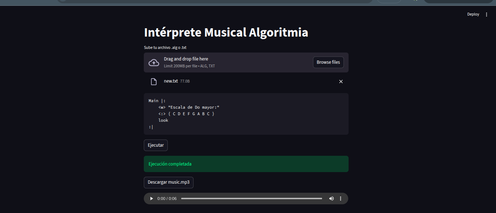

# Correr

1. Tener instalado ANTLR en pycharm y crear un entorno virtual

2. Instalar dependencias:
```console
pip install -r requirements.txt
```

3. Instalar ANTLR4 en ubuntu:

```console
sudo apt-get install -y antlr4
```

4. Generar archivos segun gramatica:

```console
antlr4 -Dlanguage=Python3 -visitor Algoritmia.g4
```

5. En ubuntu, instalar:

```console
sudo apt install lilypond

sudo apt install timidity

sudo apt install ffmpeg
```

6. Probar funcion directa:

```console
python3 algoritmia.py new.txt
```

7. Iniciar Streamlit:

```console
streamlit run app.py
```

Vista del Streamlit


